# Frontend do portal Idev

###### O objetivo é criar um portal para publicação de conteúdo de estudos sobre programação e possibilitar aos membros a terem acesso aos conteúdos, desafios e questionários. Todo o portal é baseado em gamefication e por isso existe um ranking

##### Comunidade de estudos de programação

###### Projeto no figma

[Clique aqui](https://www.figma.com/proto/pcKXkGzI8VrrmDPcv1V9cN/Comunidade-IDEV?node-id=0%3A3&scaling=scale-down)

###### Tecnologias

- ReactJS

###### Api

<http://idev-app.herokuapp.com/>

###### Preview das telas

[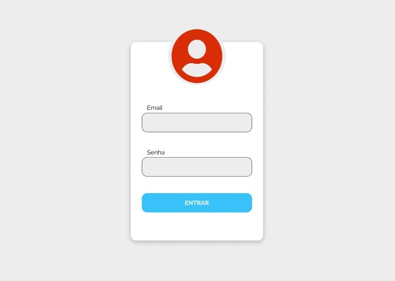](http://figma "IMAGEM")

[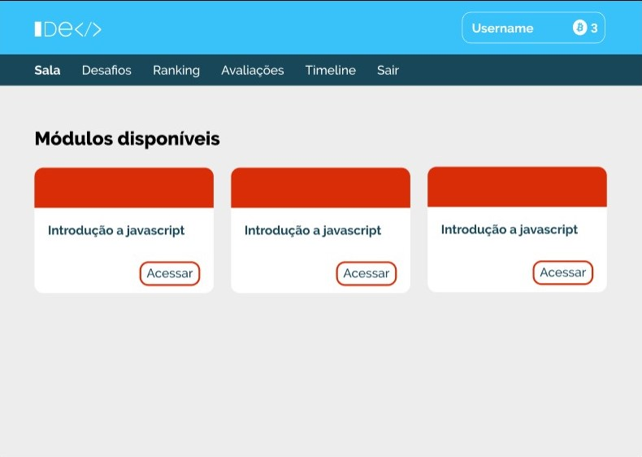](http://figma "IMAGEM")

[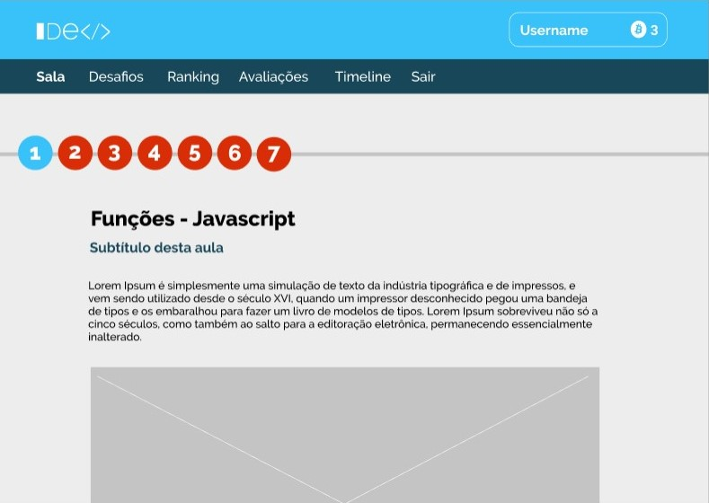](http://figma "IMAGEM")

[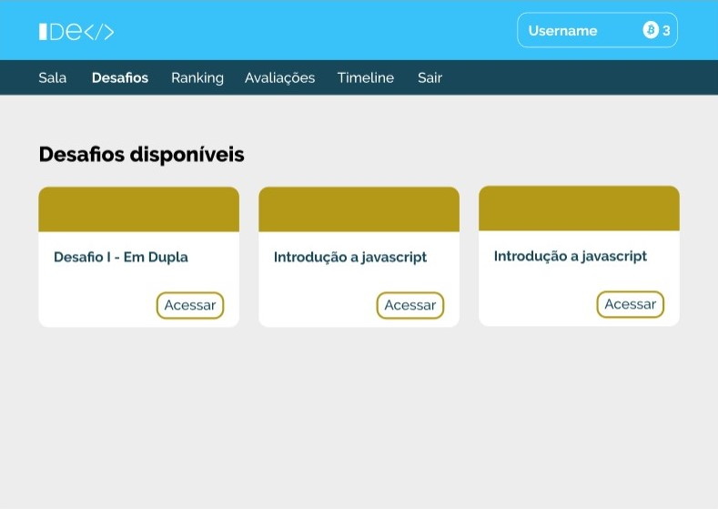](http://figma "IMAGEM")

[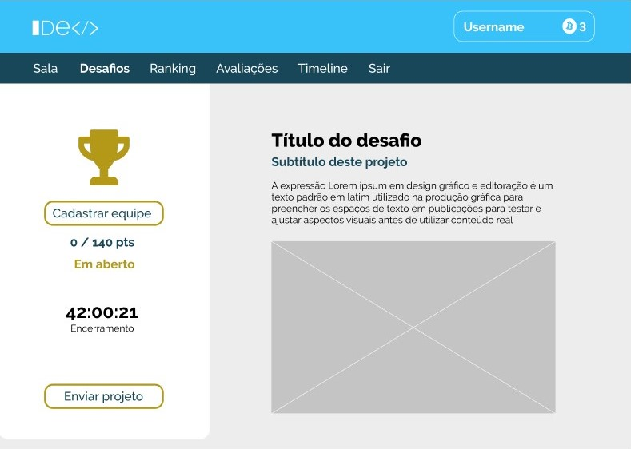](http://figma "IMAGEM")

[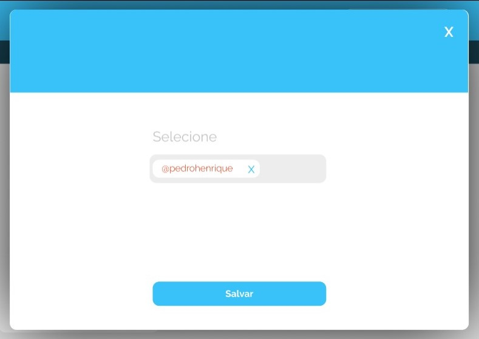](http://figma "IMAGEM")

[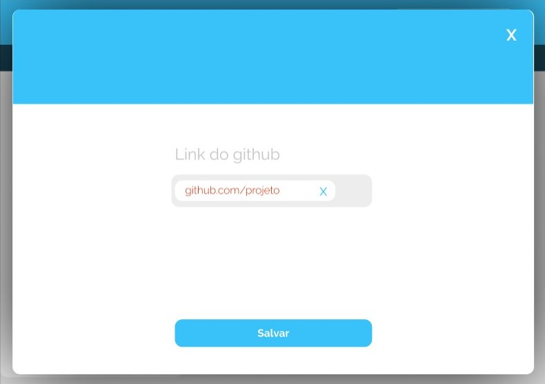](http://figma "IMAGEM")

[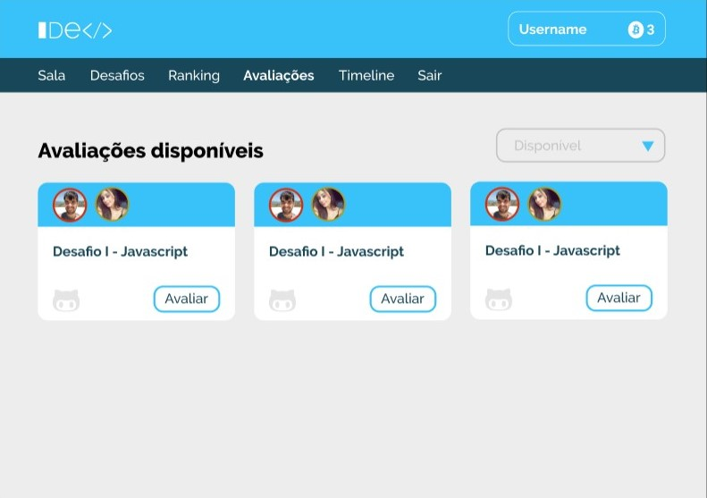](http://figma "IMAGEM")

[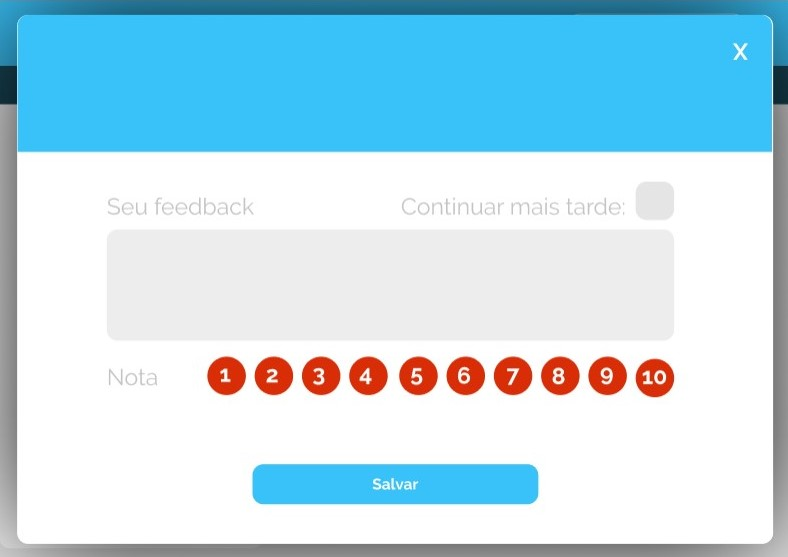](http://figma "IMAGEM")

[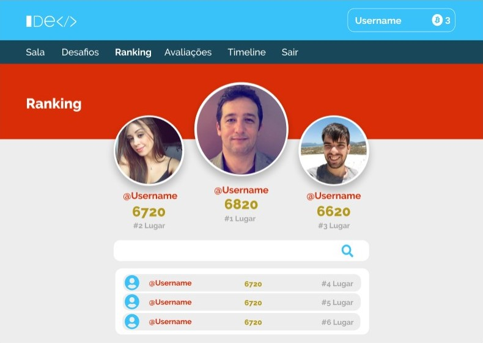](http://figma "IMAGEM")

[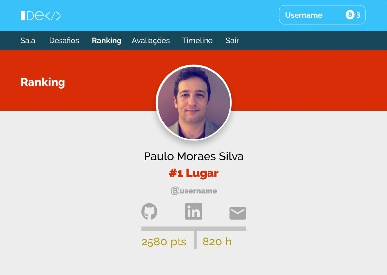](http://figma "IMAGEM")

[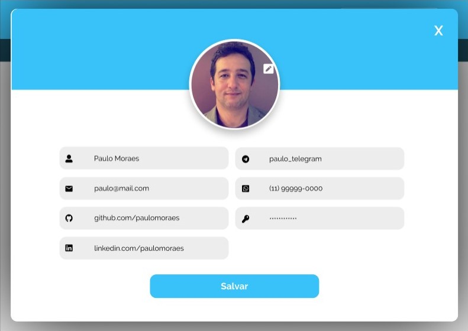](http://figma "IMAGEM")

[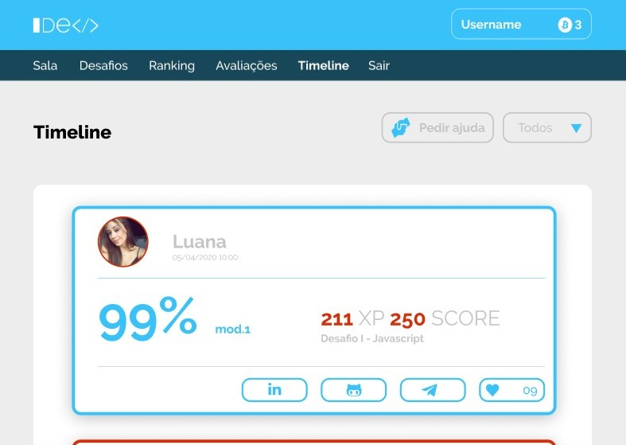](http://figma "IMAGEM")

[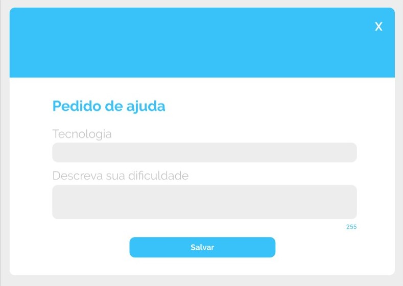](http://figma "IMAGEM")
